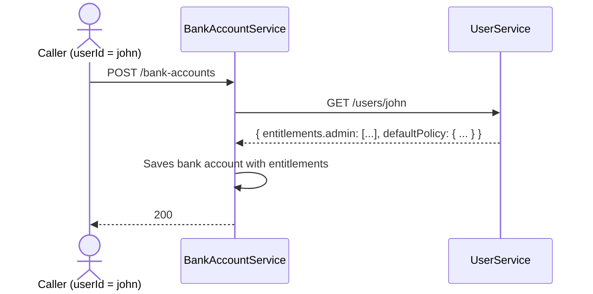
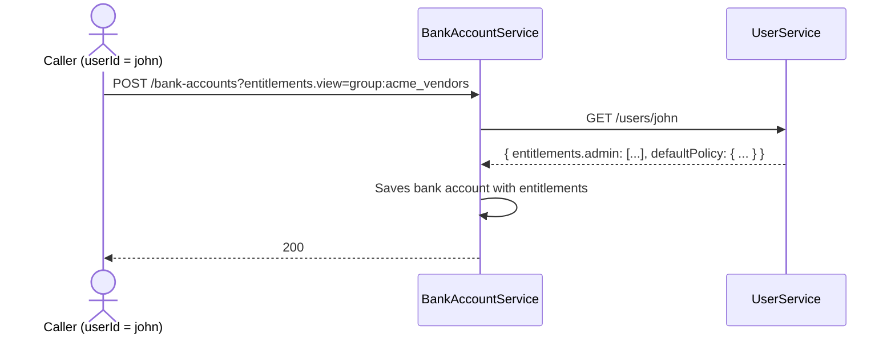

# entitlements-manager

This project outlines a practical approach to generically managing user permissions on any given platform

# Use Cases

- As an employee of "Acme Corp", any articles I create should be visible to my organization's administrators

- As a Premium subscriber, I should be able to view every article on the platform (that is open to premium subscribers) - without having to be manually added to each such Article manually

- As the administrator of "Acme Corp", I should be able to view and edit all the articles that my employees have published

- As an average user, I should be able to publish an article and select whom I want to share it with

# Concepts

The following key concepts can be implemented as REST API end points for CRUD operations, with corresponding persistence. Once implemented, the use cases highlighted above should be easily solvable

## Entity

A _noun_ that users can manipulate, this forms the basis for entitlements management in that ultimately, all permissions are reduced to the form "subject X can do verb Y on entity Z". Entities have the following schema:

```yaml
entityType: Article
entityId: 12
property1: some value
property2: some value
entitlements:
 view: 
  - user:john
  - group:premium_readers
  - group:acme_corp_employees
 edit:
  - user:ceo_guy
  - group:senior_editors
```

## User

A user is represented by the following schema

```yaml
entityType: User
entityId: john
tokens:
 - group:premium_readers
 - group:acme_corp_employees
entitlements:
 view:
  - user:john
  - group:administrators
  - group:premium_users
 edit:
  - group:administrators
  - group:acme_corp_administrators
  - user:john
```

## Groups

A group is a special entity type - which can be added/removed to `entitlements` of any other entity. It has the schema:

```yaml
entityType: Group
entityId: premium_readers
name: Premium Readers
description: |
  Subscribers to our premium service
entitlements:
  view:
   - group:administrators
  add_member:
   - group:administrators
   - machine_user:subscription_service_bot
  remove_member:
   - group:administrators
   - machine_user:subscription_service_bot
  edit:
   - group:administrators
   - user:ceo_guy
```

Another example:


```yaml
entityType: Group
entityId: acme_corp_administrators
name: Acme Corp Administrators
description: |
  The most powerful people at Acme Corp
entitlements:
  view:
   - group:administrators
   - group:acme_corp_administrators
  add_member:
   - group:administrators
   - machine_user:acme_corp_administrators
  remove_member:
   - group:administrators
   - machine_user:acme_corp_administrators
  edit:
   - group:administrators
   - user:acme_corp_administrators
```

# Solving Use Cases

Let's take the use case from above:

 > As an employee of "Acme Corp", any articles I create should be visible to my organization's administrators

When our user `john` goes to create an `Article`. We check that `acme_corp_administrators` is part of this `User`'s `entitlements.admin` action. Therefore, the resulting `Article` must have `admin: [acme_corp_administrators]`. In fact - all values of the user's `entitlements.admin` block is copied over to the descendant object's `entitlements.admin` property

This makes senses because we are basically saying: any entities spawned the user is administrable by anyone who can administer the user. This transitive copying of administrative privileges ensures that the top dogs at Acme Corp can always keep an eye on what their employees are doing

# How do I add a user to a group?

If you have `admin` perms on a specific `User` then you can modify their `token` property to add them to a group. For exampel:

Suppose you are an admin from Acme Corp, and John is an employee:

```yaml
entityType: User
entityId: john
token:
 - user:john
 - group:acme_corp_employees
entitlements:
 view:
  - user:john
 admin:
  - group:acme_corp_administrators
```

### Now you'd like to add him to the Party planning committee at your company, then you'd call the following REST API:

```http
PUT /api/v1/users/john
{
  "token": ["acme_corp_party_planning_committee"]
  "effect": "add"
}
```

This call will succeed because you - being part of `group:acme_corp_administrators` - have `admin` privilege on `User: john`

### What if John tries to add himself as a member of the party planning committee?

The above request will fail, because John does not possess `admin` privilege on his own profile and thus cannot modify `token`

# Database Tables Needed:

- 1 table per Entity (such as `Article`, `BankAccount`, `ShoppingCart` etc.)
- A `User` table
- A `Group` table
- A `DefaultPolicy` table (to be explained later)

That's it ... 

# Microservices Needed:

- A `UserService` that will manage `User` and `Group` lifecycles
- Each entity can be managed by their corresponding microservices however your organization wish to divide up the domain boundaries

> Each microservice will need to call the `UserService` to get User and Group permissions

# Example of Microservices In Action

## Example 1. `BankAccountService` to allow users to create bank accounts

The API caller (authenticated as `john`) has the following `User` object:

```yaml
entityType: User
entityId: john
tokens: [group:acme_corp_employee]
entitlements:
 admin:
  - group:acme_corp_administrators
  - group:administrators
defaultPolicy:
 policyId: p1
 bankAccounts:
  view:
   - group:acme_corp_treasurers
  move_money:
   - group:acme_corp_treasurers
```

 >
 > Note the new `defaultPolicy` block - this is a separate object which instructs the microservice how to populate the default
 > entitlements for various objects that the user creates on the system. The `BankAccountService` must respect this `defaultPolicy`
 > 

### Sequence of events:



The resulting `BankAccount` is as follows:

```yaml
entityType: BankAccount
entityId: BA0023
entitlements:
 view:
  - user:john
  - group:acme_corp_treasurers
 move_money:
  - user:john
  - group:acme_corp_treasurers
 admin:
  - group:acme_corp_administrators
  - group:administrators
```

## Example 2. `BankAccountService` that allows creators to _share_ a new bank account

The API caller (authenticated as `john`) has the following `User` object:

```yaml
entityType: User
entityId: john
tokens: [group:acme_corp_employee]
entitlements:
 admin:
  - group:acme_corp_administrators
  - group:administrators
defaultPolicy:
 policyId: p1
 ...
```

### Sequence of events:



The resulting `BankAccount` is as follows:

```yaml
entityType: BankAccount
entityId: BA0023
entitlements:
 view:
  - user:john
  - group:acme_corp_treasurers
  - group:acme_vendors # notice this new line
 move_money:
  - user:john
  - group:acme_corp_treasurers
 admin:
  - group:acme_corp_administrators
  - group:administrators
```

 > If we do not want _john_ to share his creation, we can add a property to `User` called `disableSharing` or create a property within `defaultPolicy` that explicitly enumerate whom the policy holder is allowed to share with

